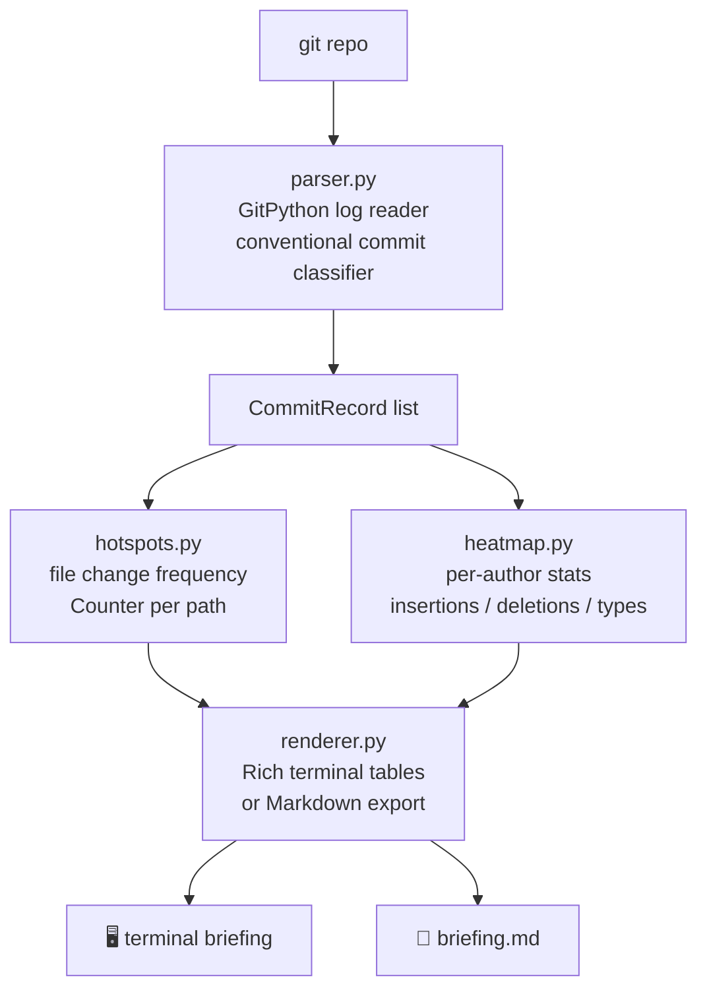

# deltabrief

> A git-powered developer briefing generator — parse commit history, classify by conventional commit type, surface file hotspots, and produce a Rich standup summary or Markdown export.

*Scheduled and created by [hellohaven.ai](https://hellohaven.ai)*

---

## Why It Exists

Every morning engineers answer the same questions: what changed since yesterday? Which files are getting hammered? Who’s been most active? `deltabrief` answers all three instantly — without opening GitHub, Jira, or Slack.

## Features

- **Conventional commit classification** — auto-detects feat/fix/refactor/chore/docs/test/perf/ci/build
- **Breaking change detection** — surfaces any `!` commits front and center
- **Hotspot file analysis** — which files changed most frequently in the window
- **Author heat map** — per-author commit counts, line insertions/deletions, and type breakdown
- **Rich terminal output** — color-coded tables with bar chart distributions
- **Markdown export** — paste-ready briefing for Slack, Notion, or PR descriptions
- **Flexible time windows** — `yesterday`, `3d`, `1w`, `48h`, or ISO date

## Architecture



## Setup

```bash
git clone https://github.com/DucChau/deltabrief.git
cd deltabrief
python -m venv .venv && source .venv/bin/activate
pip install -e .
```

## Run Instructions

```bash
# Terminal briefing for the current repo since yesterday
deltabrief brief .

# Briefing for a specific repo since 3 days ago
deltabrief brief /path/to/your/repo --since 3d

# Top 15 hotspot files over the past week
deltabrief brief . --since 1w --top 15

# Filter to a specific author
deltabrief brief . --since 1w --author "Jane"

# Export to Markdown
deltabrief export . --since 3d --output standup.md

# Author contribution table (past week)
deltabrief authors . --since 1w
```

## Example Output

```
╔══════════════════════════════════════════════════════╗
║  deltabrief — 42 commits since 2026-05-25 00:00 UTC  ║
╚══════════════════════════════════════════════════════╝

 Commit Breakdown
 ✨ Feature    12  ████████████████░░░░
 🐛 Fix         8  ██████████░░░░░░░░░░
 ♻️ Refactor    7  █████████░░░░░░░░░░░
 🔧 Chore       6  ████████░░░░░░░░░░░░

 Hotspot Files
 src/api/routes.py      9 changes
 src/models/user.py     7 changes
 tests/test_auth.py     5 changes

 Author Activity
 Alice     18 commits  +1204  -342
 Bob       14 commits   +887  -201
 Carol     10 commits   +432   -89
```

## Run Tests

```bash
pip install -e ".[dev]"
pytest tests/ -v
```

## Future Improvements

- GitHub/GitLab remote awareness (link SHAs to PR URLs)
- JIRA/Linear ticket extraction from commit messages
- Weekly digest email mode
- Team velocity trend charts (sparklines across N days)
- Config file support (`.deltabrief.toml`)

---

*Created by [hellohaven.ai](https://hellohaven.ai)*
